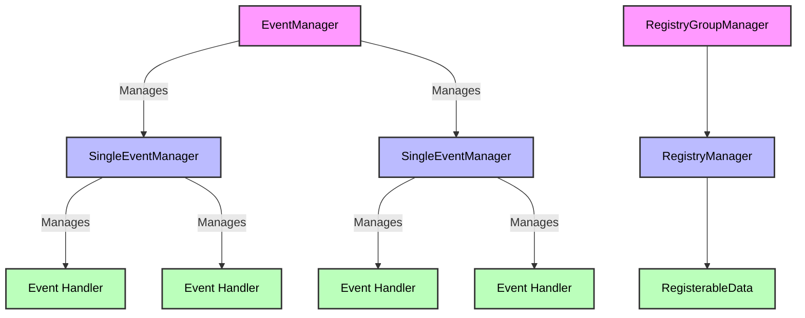

# Registry Manager

The `reg_mgr` package is used as a Registry Manager for systems like `event` and `pipe`.

## Structure

- **`RegistryManager`**: Manages a collection of `RegisterableData`.
- **`RegistryGroupManager`**: Manages a group of `RegistryManager` instances.

### Examples

In the context of the RRSS Event system, the structure works as follows:

1. **Event Handlers**: Event handlers are subclasses of `RegisterableData`.
2. **Single Event Manager**: Each event is managed by a `SingleEventManager`, which is a subclass of `RegistryManager`. This manager is responsible for handling all event handlers related to that specific event.
3. **Event Manager**: The `EventManager` is a subclass of `RegistryGroupManager`. It manages all events, essentially managing a collection of `SingleEventManager` instances.

---

- **`EventManager`** (RegistryGroupManager) → Manages multiple `SingleEventManager` instances.
- **`SingleEventManager`** (RegistryManager) → Manages multiple event handlers (`RegisterableData`) for a specific event.
- **`Event Handler`** → Subclasses of `RegisterableData` that perform actions when an event is triggered.

Check out the diagram below:



## Customize Components

### RegisterableData

Your custom registerable data **must be derived from `RegisterableData`**, which serves as a basic data class containing essential fields.

However, you may need to **add new methods or fields based on your requirements**. For instance, in an event system, you might introduce a new method like `emit()`.

> Refer to the docstring of `RegisterableData` for more details, or check the implementation of `EventHandler` as an example.

### RegistryManager

In this package, **`RegistryManager` is defined as a Protocol**, allowing flexibility in its implementation.

You can create your own `RegistryManager` class based on your specific needs. However, some basic implementations are already provided:

- `ListRegistryManager`
- `PriorityListRegistryManager`

> Check the docstrings of these classes for more details.

### RegistryGroupManager

`reg_mgr` provides registry group manager class to manage a group of different registries.

You may want to **extend the ability of the group manager by creating a subclass of it**. _(Check out `EventManager` in `event` extension package for example)_

## Customize Exceptions

`reg_mgr` allows you to set custom exception classes that will be raised by `reg_mgr`.

### Available Customizable Exceptions

The following four exceptions can be customized via configuration. Refer to the exception class docstrings in `reg_mgr.errors` for detailed descriptions:

- `registry_not_found`
- `registry_data_not_found`
- `duplicated_registry_data`
- `duplicated_registry`

---

### Class Field Customization

To customize exceptions, override the `__reg_mgr_custom_exceptions__` member field in a subclass of `RegistryManager` or `RegistryGroupManager`.

### Initialization Method Customization

You can also pass a `custom_exceptions` _(not None)_ parameter to the `__init__()` method of `RegistryManager` or `RegistryGroupManager`:

```python
mgr = RegistryManager(..., custom_exceptions=my_custom_exception_config)
```

> This approach will take precedence of previous one. Which means the custom config passed to `__init__()` method will override the class field.

### Inherit from RegistryGroupManager

When `RegistryManager` is automatically created by `RegistryGroupManager` (typically when `RegistryGroupManager.add_registry()` is called), the **custom exception configuration of the group manager will be passed to the new registry manager's `__init__()` method via the `custom_exceptions` parameter**.

> This mechanism ensures that **custom exception settings for `RegistryManager` instances
> created by `RegistryGroupManager` cannot be overridden**. Even if you override the custom exceptions
> configuration field in a `RegistryManager` subclass, the settings from the group manager will take precedence.
